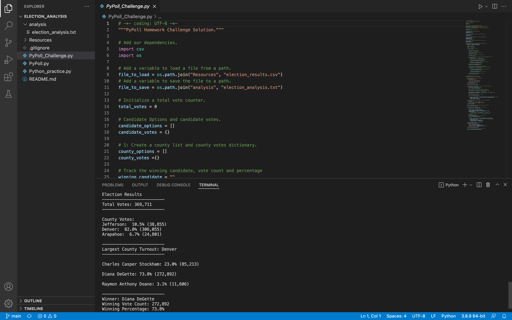

# Election_Analysis

## Overview of Election Audit
The purpose of this project is to assist the Colorado Board of Election perform an audit on a recent local congressional election. The analysis is performed using Python script on a data set containing election results data. The following tasks were completed:

1. Calculate the total number of votes cast
2. Calculate the number of votes cast in each county in the precinct
3. Determine the county with the largest voter turnout
4. Calculate the number of votes and percentage of votes each candidate received
5. Determine the winner of the election based on popular vote

## Resources
- Data Source: election_results.csv 
  https://github.com/kristindong/Election_Analysis/blob/4c7f05a4710c51b1c07ac23febef6c424507e598/Resources/election_results.csv
- Software: Python 3.7.6, Visual Studio Code 1.65.2 

## Election Audit Outcome

Results of the election audit are summarized below.

* Total Votes Cast: 369,711

* Votes by County:
  * Jefferson:  10.5% (38,855)
  * Denver:  82.8% (306,055)
  * Arapahoe:  6.7% (24,801)

* Largest County Turnout: Denver

* Votes by Candidate:
  * Charles Casper Stockham: 23.0% (85,213)
  * Diana DeGette: 73.8% (272,892)
  * Raymon Anthony Doane: 3.1% (11,606)

* Election Results:
  * Winner: Diana DeGette
  * Winning Vote Count: 272,892
  * Winning Percentage: 73.8%

A text file containing the audit results can be found here:
https://github.com/kristindong/Election_Analysis/blob/50a03a50484d6af8364f489912598d382ab73a71/analysis/election_analysis.txt

The results can be displayed directly in VS Code:

## Election Audit Summary
The Python script used in this project can be used for any election, provided that the data is stored in csv format and contains county and candidate name for each vote cast. Some modifications may be needed
1. The data file name may need to be updated in the script

2. Depending on which column the county and candidate names are stored, the index values in the code below may need to be adjusted:

